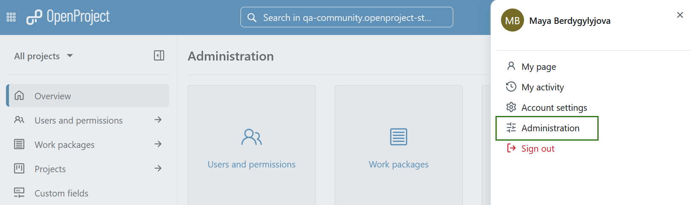
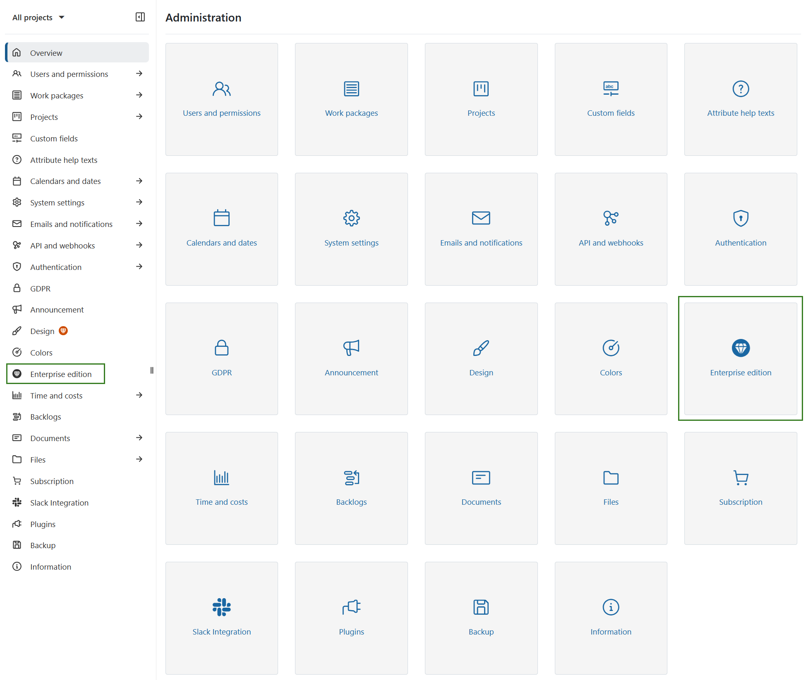
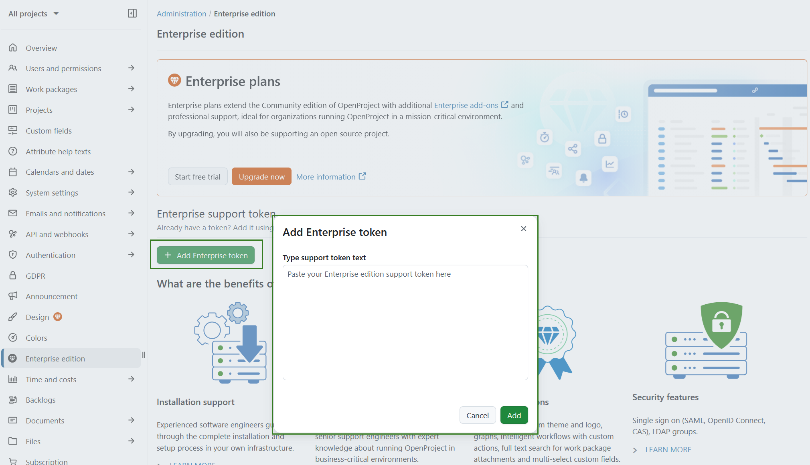
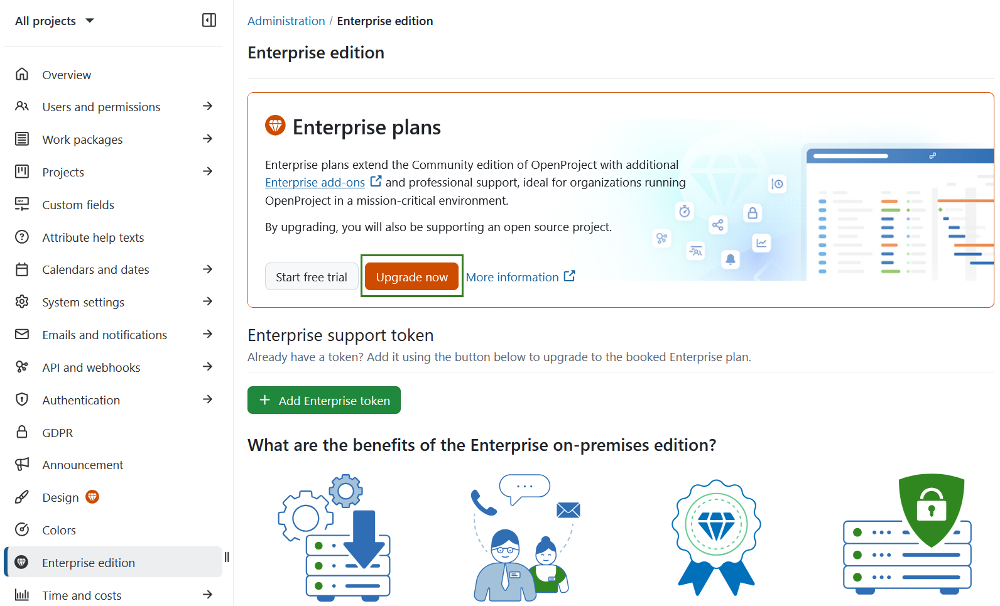

---
sidebar_navigation:
title: Activate Enterprise on-premises
priority: 990
description: Activate the OpenProject Enterprise on-premises edition.
keywords: activate, enterprise on-premises, token, license key
---

# Activate the Enterprise on-premises edition

The OpenProject **Enterprise on-premises edition** extends the Community edition with additional Enterprise features.

To upgrade your existing OpenProject Community edition, sign in to your OpenProject instance with an **administrator account**.

1. Click your **user avatar** in the upper-right corner and select **Administration** from the dropdown menu.

2. In the administration menu, select **Enterprise edition**.

3. If you already have an **Enterprise on-premises token**, click **+ Add enterprise token**, paste the **full token content** into the dialog, and click **Add** to save.

   

If you do not yet have a token, you can either [order an Enterprise on-premises token](#order-the-enterprise-on-premises-edition) or [request a trial token](../enterprise-on-premises-trial).

Once the token is saved successfully, your **Enterprise on-premises edition is activated** and the Enterprise add-ons become available immediately.

## Order the Enterprise on-premises edition

To **upgrade to the Enterprise on-premises edition**, click the **Upgrade now** button displayed on the Enterprise edition page. Alternatively, you can [request a trial token](../enterprise-on-premises-trial) to evaluate the Enterprise add-ons before purchasing.

After purchasing an Enterprise on-premises token or receiving a trial token, activate it by pasting the token into the Enterprise edition section as described above.

For detailed information about pricing, booking, and billing, see our [pricing and FAQ page](https://www.openproject.org/pricing/#faq).
