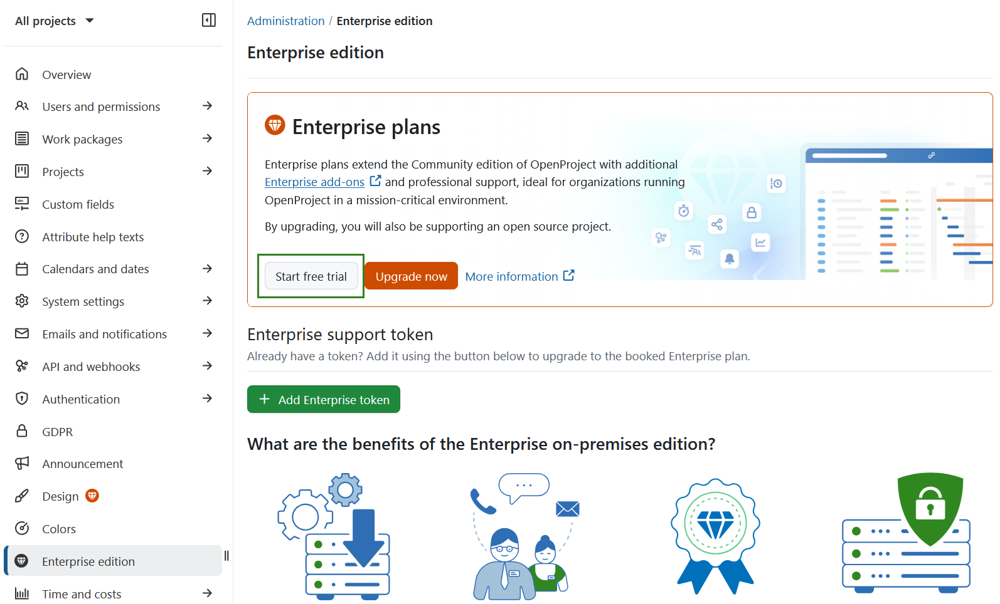
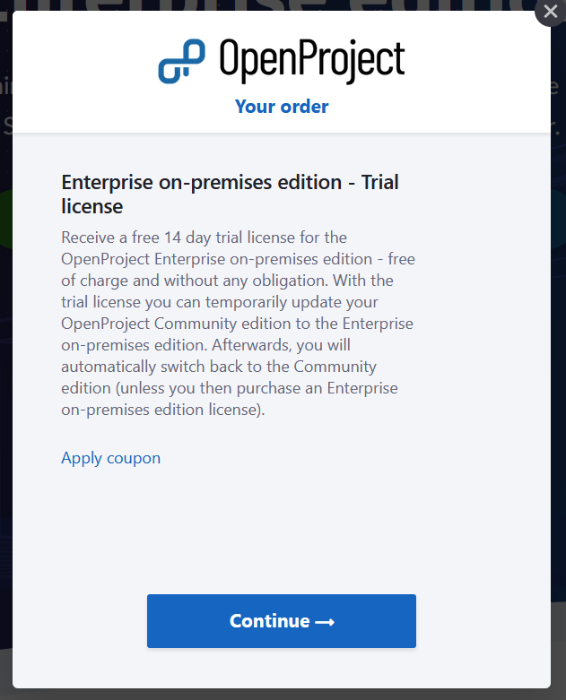

---
sidebar_navigation:
  title: Enterprise on-premises trial
  priority: 999
description: Create an OpenProject Enterprise edition trial installation.
keywords: enterprise on-premises, trial, eop
---
# Create an Enterprise on-premises edition trial

You can **test the OpenProject Enterprise on-premises edition for 14 days free of charge**. The trial temporarily extends your existing Community edition with Enterprise add-ons, allowing you to thoroughly evaluate the Enterprise features.

You can start the trial in one of the following ways:

## Option A: Start a trial from an existing Community installation

If you already have an OpenProject Community edition installed, you can start the trial directly from your system:

1. Navigate to **Administration → Enterprise edition**.
2. Click the **Start free trial** button.

## Option B: Request a trial via the OpenProject website

Alternatively, you can request a free trial token via the OpenProject website:

1. Go to the [Enterprise edition page](https://www.openproject.org/enterprise-edition/).
2. Click the **Get a free on-premises trial license** button.

A dialog will appear explaining that you will receive a **14-day free trial license**, which can be used to temporarily upgrade your Community edition.

3. Click **Continue**.
4. Enter your email address and provide your details (first name, last name, company name, and phone number).

You will then **receive the Enterprise on-premises trial token by email**, along with instructions on how to [activate the Enterprise on-premises edition](../activate-enterprise-on-premises/).

> [!NOTE]
> There is no need to cancel the trial. The license expires automatically after 14 day
