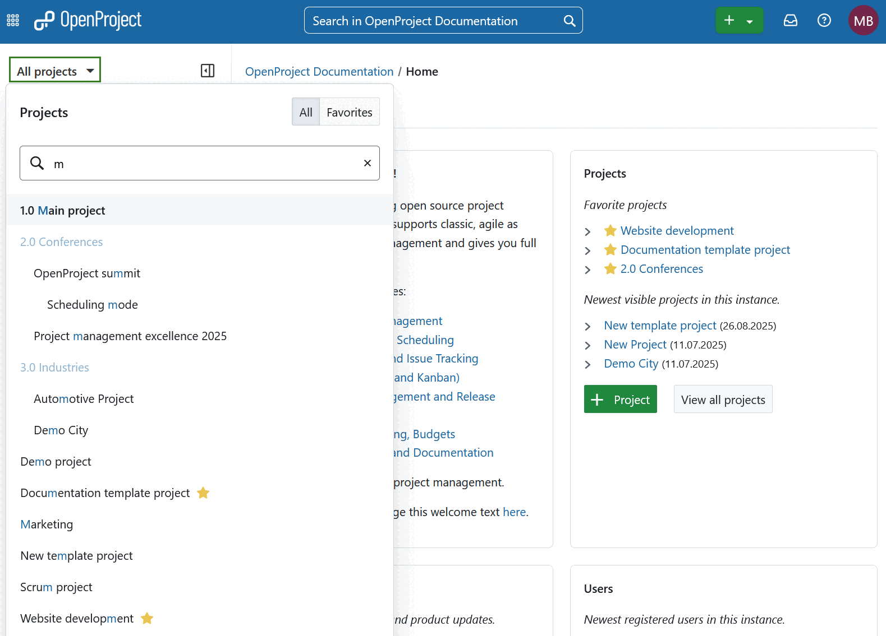
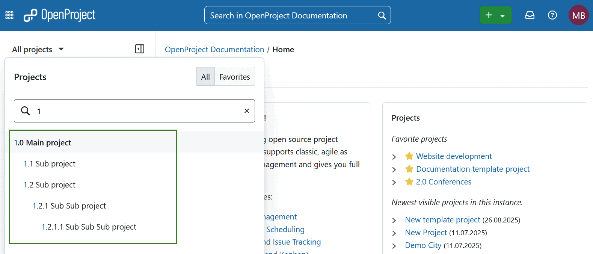
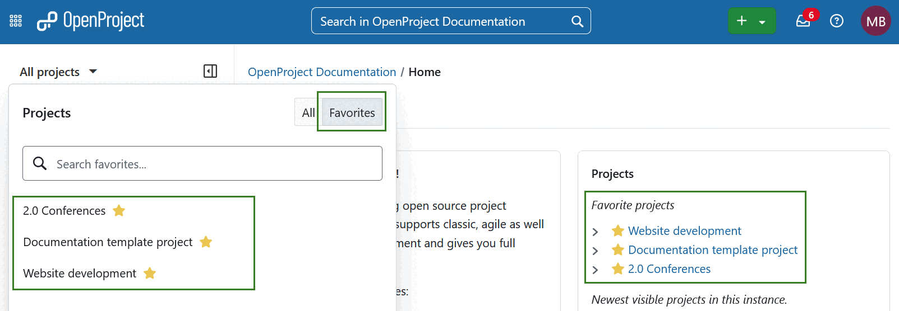
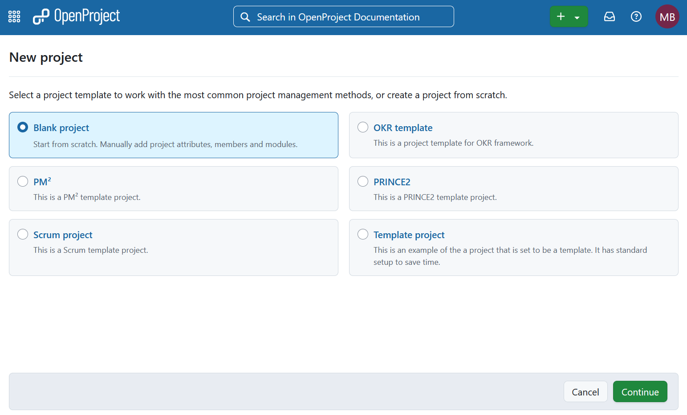
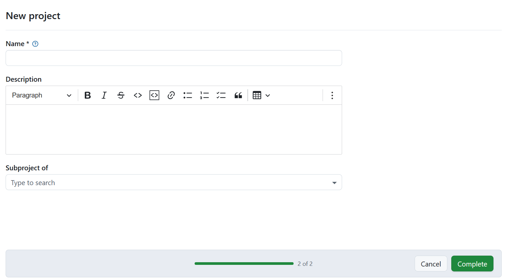
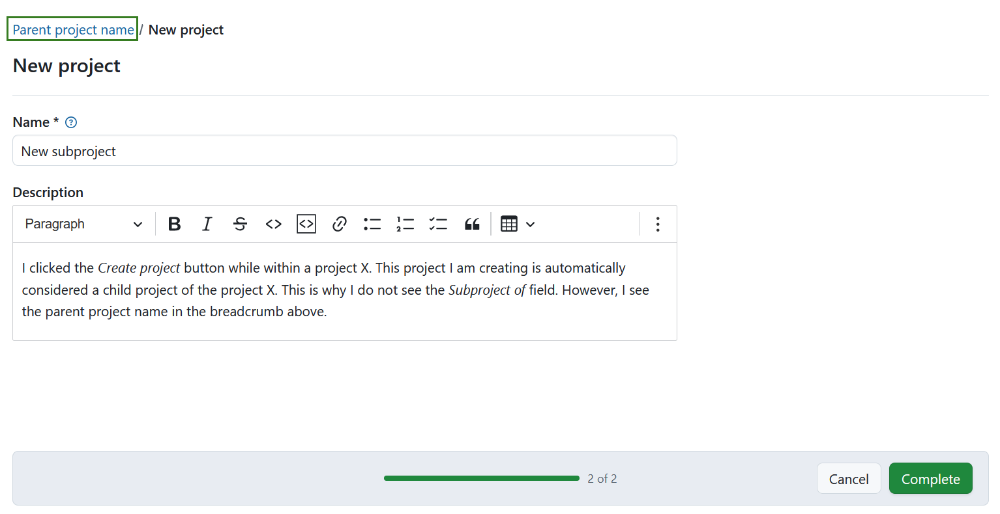
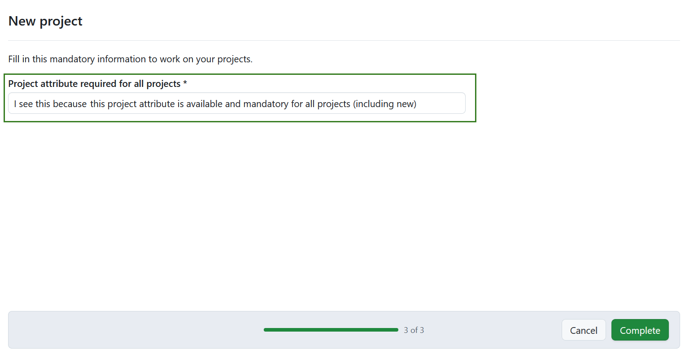

---
sidebar_navigation:
  title: Projects
  priority: 900
description: Introduction to projects in OpenProject.
keywords: open project, create project, projects introduction
---
# Projects introduction

Get an introduction how to work with projects in OpenProject. To start collaboration in OpenProject, you first have to set up a new project.

A **project** is defined as a temporary, goal-driven effort to create a unique output. A project has clearly defined phases, a start and an end date, and its success is measured by whether it meets its stated objectives.
A project in OpenProject can be understood as a project as defined above. Also, it can be set up as a "workspace" for teams to collaborate on one common topic, e.g. to organize a department.

>  [!NOTE]
>
> In order to see a project and work in it, you have to be a [member of the project](../invite-members).

| Topic                                                   | Content                                                      |
| ------------------------------------------------------- | ------------------------------------------------------------ |
| [Open a project](#open-an-existing-project)             | Select and open an existing project.                         |
| [Create a new project](#create-a-new-project)           | Create a project from scratch or use existing project templates. |
| [View all projects](#view-all-projects)                 | Get an overview about all your projects.                     |
| [Advanced project settings](#advanced-project-settings) | Configure further advanced settings for your project.        |

<video src="https://openproject-docs.s3.eu-central-1.amazonaws.com/videos/OpenProject-Projects-Introduction.mp4"></video>

## Open an existing project

In order to open an existing project, click the **All projects** dropdown menu in the upper left corner of the header and select the project you want to open.

You can also start typing in a project name to filter by the project's title or filter for favorite projects. 

Projects and subprojects are displayed according to their hierarchy in the drop-down menu.

**Subproject** is defined as a child project of another project. Subprojects can be used to display a hierarchy of projects. Several filter options (e.g. in work package table and timeline) can be applied only to the current project and its subprojects.

Alternatively, you can open the list of all existing projects using the [**Global modules**](../../user-guide/home/global-modules/#projects) menu.

Also, you will see your newest and favorited projects on the application landing page in the **Projects** section. Here you can simply click on one of the projects to open it. Alternatively, select favorite projects from the **All projects** dropdown menu by using the respective switch.

## Create a new project

There are several ways to create a new project in OpenProject. Keep in mind that the ability to create a new project is tied to correct [permissions](../../system-admin-guide/users-permissions/roles-permissions/).

1. Click the green button **+ Project** directly on the system's home screen in the **Project** section.

   

2. You can also use the **+ (Plus)** button in the top right corner of the header navigation. 

3. In addition, you can also create a new project on the [project lists](../../user-guide/projects/project-lists/) overview page. 

4. If the project you are creating is subproject, navigate to the [project settings](../../user-guide/projects/project-settings/) and use the *+ Subproject* button.

### Choose how to create your project
You can create either:

- a **blank project** (a completely new and empty project), or 
- a project **based on a template**.

The **Blank project** option is selected by default.

>  [!TIP]
> If you do not see any template options, this may be because no projects have been set as [project templates](../../user-guide/projects/project-templates/#create-a-project-template) yet, or because you do not have access to any template projects. Only templates that are public or where you are a project member are shown, allowing different user groups to see only the templates relevant to them.

Click **Continue** to proceed.

### Define project details

Next, enter the **name** and an optional **description** for your project.  You can also integrate the project into your existing project hierarchy by selecting a **parent project**, which will make the new project a **subproject**.

Click **Complete** to finish the setup.

> [!TIP]
> If you started creating a new project (project B) from within any other project (project A), project B is considered a subproject of project A. 
> In this case, the **Subproject of** field is not shown, but the parent project appears in the breadcrumb navigation.
> If this was not your intention, you can change or remove the parent project later in the project settings of project B.

> [!TIP]
> If there are project attributes configured as **required**, an additional step will appear during project creation. You must fill in these attributes before you can complete the setup.

### Project members

The project members of a newly created project depend on how the project was created:

- **Blank project**: The user creating the project will be added automatically as a member, project role is based on the [corresponding setting in administration](../../system-admin-guide/projects/new-project/). 
- **From a template**: The project inherits the same members and roles as defined in the template.
- **Copied from another project**: The project inherits the members and roles from the original project. See here [how to copy a project](../../user-guide/projects/project-settings/project-information/#copy-a-project).

To continue configuring your project, see the documentation on [project settings](../../user-guide/projects/project-settings/project-information/).

## View all projects

To view all your projects in which you are a member, use the [**Global modules menu**](../../user-guide/home/global-modules/#projects) on the left or select *Projects* using the grid icon in the top left corner.

You will see a list with all your projects and their details.

## Advanced project settings

In our detailed user guide you can find out how to configure further [advanced project settings](../../user-guide/projects/) for your projects, e.g. description, project hierarchy or setting it to public.
