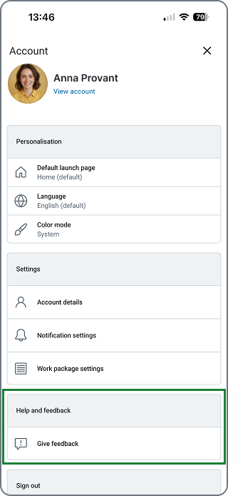
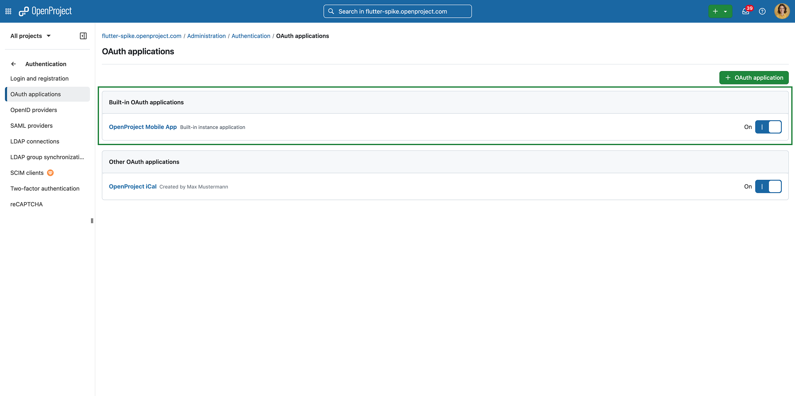

---
sidebar_navigation:
  title: Mobile app guide (Beta)
  priority: 972
description: User guide for the OpenProject Mobile application.
keywords: Mobile app guide, mobile, mobile application, iOS, android, app store, appstore, app-store, google play
---
# Mobile app guide (Beta)

We are excited to announce the **Beta Release** of the **OpenProject Mobile app** — now available in the **App Store** and **Google Play Store**. This Beta version marks the beginning of our journey to bring **OpenProject** to your mobile devices, enabling you to stay connected and productive wherever you are.

> [!NOTE]
> The app is currently under active development, and core features are being continuously improved. We invite you to test the app, share feedback, and help shape the future of OpenProject Mobile.

## Purpose and Vision

The **OpenProject Mobile app** is designed as a **companion application** to the OpenProject web and desktop experience. It allows you to:

- **Access your work packages** and projects on the go.
- **React and respond** quickly to updates, comments, and notifications.
- **Stay informed** about project progress, tasks, and deadlines — anytime, anywhere.
- **Track your work and log time** directly within the app to keep your reporting up to date.

The goal is to provide **lightweight mobile access** for essential collaboration and project management tasks, perfectly complementing the full web experience of OpenProject.

## Current Beta Features

In this initial Beta version, you can:

*   Log in securely with your **OpenProject credentials.**
*   View and edit your **work packages.**
*   **Comment** and **reply** to discussions.
*   View your **portfolio, program or project** details.
*   Receive **notifications** about updates and mentions.
*   Quickly **search** and **filter** work packages.
*   **Track** and **log** your work time.

## Mobile-Only Features

The **OpenProject Mobile App** introduces a set of features built specifically for mobile devices, designed to make project management faster, more focused, and more convenient wherever you are:
*   **Attach photos directly from your camera:** Capture and upload images instantly to work packages or comments — ideal for documenting on-site work, visual progress, or issues in real time.
*   **Local notifications:** Stay up to date with mentions, comments, and task updates through local notifications — even when the app isn’t open. *These notifications are not yet real-time push notifications.*
*   **Create work packages fast:** Quickly add new work packages in a distraction-free interface designed for fast, mobile-friendly input.
*   **Run timers in focus mode:** Track your work time effortlessly with built-in timers that run in the background, helping you stay focused and accurate with time logs.
*   **Configure modules and dashboards:** Customize what you see by enabling only the modules and views most relevant to you — keeping your mobile workspace clean and efficient.
*   **Optimized touch interface:** Navigate with ease using gestures, adaptive layouts, and mobile-first design tailored for smaller screens.

These mobile-specific capabilities enhance your ability to **work efficiently, document instantly, and stay connected** — all while maintaining focus and flexibility on the go.

## Coming Soon

The app is still under development, and many core features are planned for future updates, including:

*   **Deep-linking (including on-premises support):** Seamlessly open specific work packages, projects, or comments directly from links in emails, chats, or browser pages — whether you’re using the cloud or an on-premises instance.
*   **Multi-device UI:** Enjoy a consistent, responsive experience across phones, tablets and macOS, with layouts optimized for each device size and orientation.
*   **Real-time push notifications:** Receive updates instantly as they happen — from mentions and comments to task status changes — ensuring you never miss important activity.
*   **Write internal comments:** Add internal comments directly from the app, enabling secure collaboration within your project team while keeping external communications separate.
*   **Meeting agendas in the app:** Access and review meeting agendas on the go to stay prepared and aligned with your team wherever you are.

These upcoming features will make the OpenProject Mobile App even more connected, collaborative, and aligned with the full OpenProject experience.

## Feedback and Involvement

As a Beta user, your feedback is invaluable. If you encounter issues or have suggestions, please let us know:&nbsp;

*   Using the **flow to provide feedback** directly from the **app** in the user settings.

*   Create a **feedback work package** directly in [OpenProject **Community** instance](https://community.openproject.org/) and assign it to *Stream Mobile App*.

Your input directly helps improve the mobile experience and ensure a stable, feature-rich public release.

## Availability

The **OpenProject Mobile App (Beta)** is available now for:

*   **iOS:** [App Store link](https://apps.apple.com/us/app/openproject/id6474431879).
*   **Android:** [Google Play link](https://play.google.com/store/apps/details?id=org.openproject.app).

## Requirements

To access and use the **OpenProject Mobile App (Beta)**, you’ll need the following:

*   **An active OpenProject account:** Either from an **OpenProject Cloud** workspace or an **OpenProject On-premises** installation with API access enabled.
*   Having a **signed certificate** (**https**, not http) on your instance to be able to log in.
*   **OpenProject version:** 17.0.0 or above
> [!NOTE]
> If you have a previous version of OpenProject you can connect your OpenProject instance by asking your administrator to enable the Built in OAuth applications flag under_ `_{BASE_URL}/admin/settings/experimental_`.
*   **Minimum system requirements:**
    *   **iOS 15** or later
    *   **Android 12** or later
*   **Built-in OAuth applications enabled:** Make sure that the built-in OAuth applications are **enabled in your administration settings** (`{BASE_URL}/admin/oauth/applications`). This is required for successful login from the mobile app.

*   **Network connection:** Internet access is required for syncing data with your OpenProject instance.
> [!NOTE]
> Some features, such as deep-linking and real-time push notifications, may depend on your organization’s configuration or will become available in future updates.

## Disclaimer

> [!IMPORTANT]
> This is a **Beta Release**, which means the app may contain incomplete features and occasional bugs. We recommend using it alongside the **OpenProject web application** for the full experience.