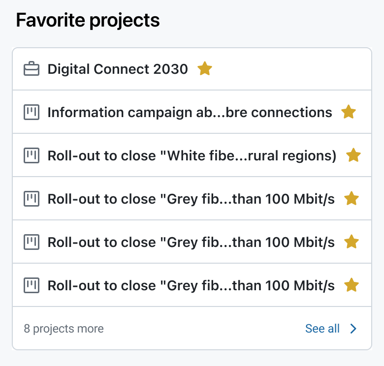
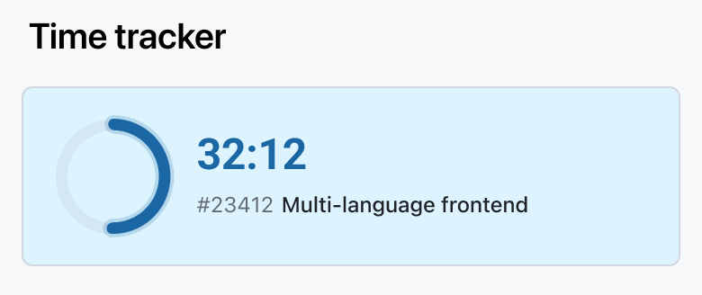
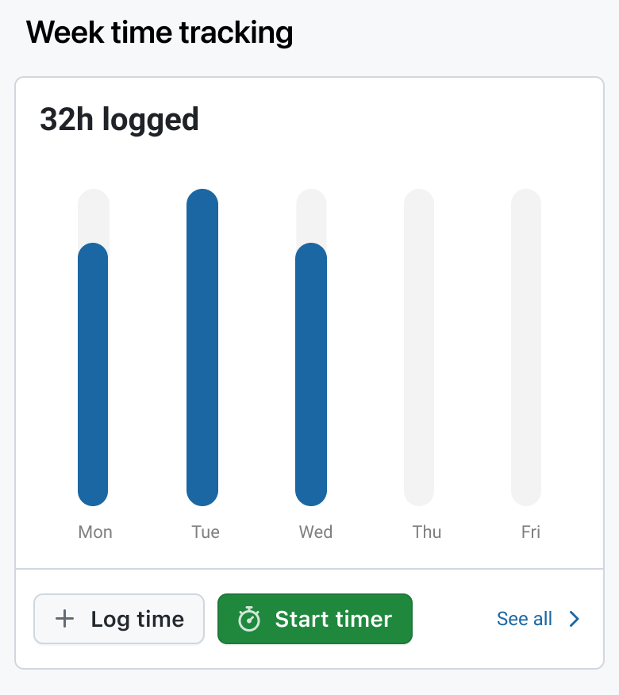
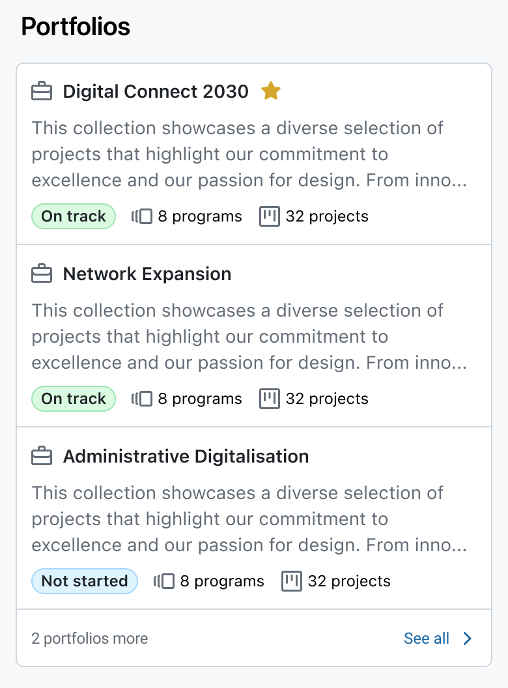
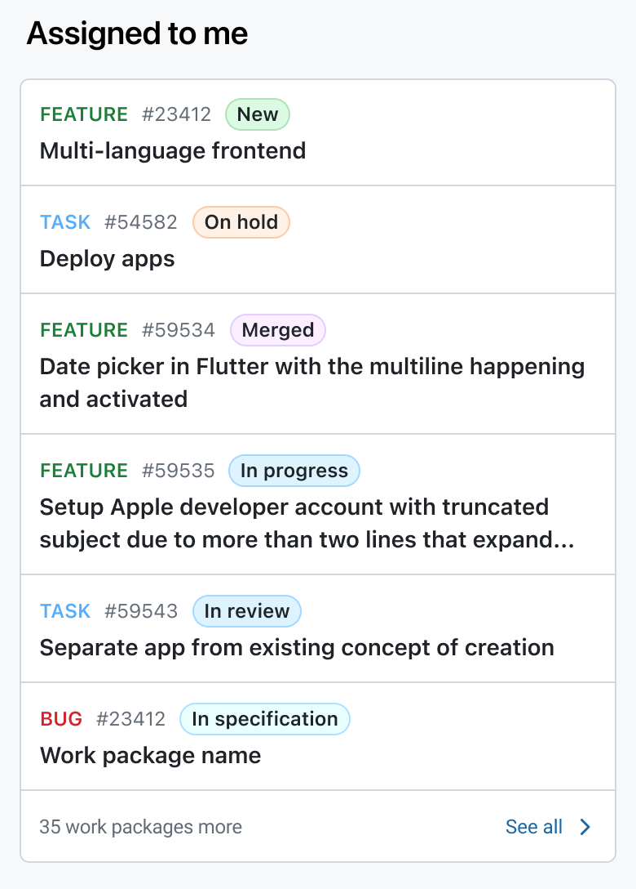
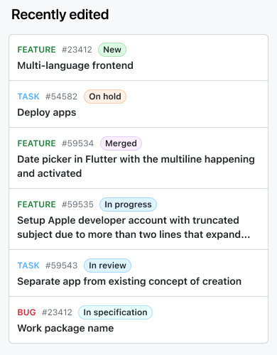
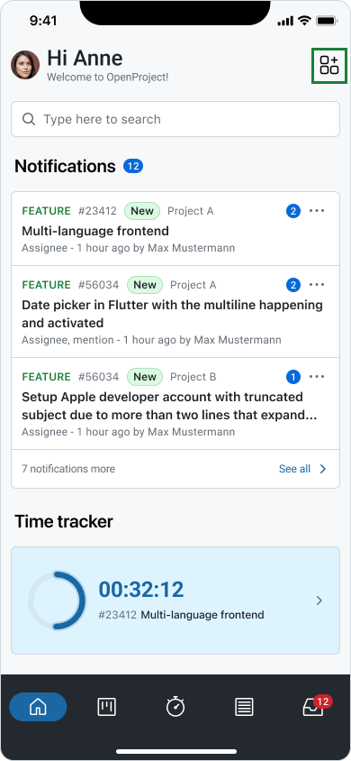
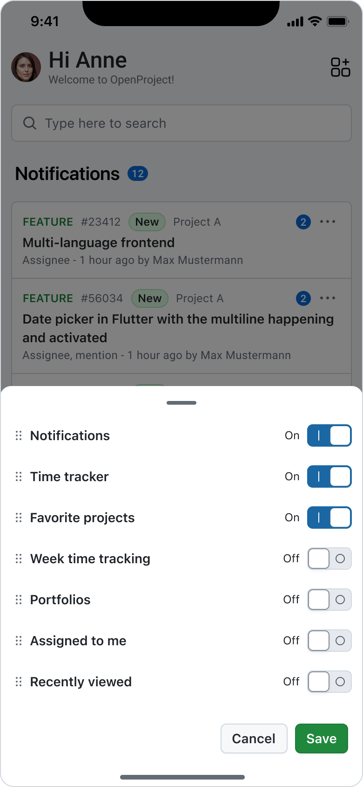

---
sidebar_navigation:
  title: Home Dashboard
  priority: 790
description: Create a personalized overview of your projects, work packages, and activities.
keywords: Mobile app features home dashboard
---

# Home Dashboard

The **Home Dashboard** is your go-to screen for staying informed, focused, and efficient on mobile — providing an at-a-glance view of everything that matters across your projects. It allows creating a **personalized overview of your projects, work packages, and activities**, helping you stay informed and productive on the go.

The dashboard is designed to give you **quick access to the information you care about most**, without needing to navigate deep into individual projects or work packages.

## Purpose

The Home Dashboard is your **central hub** for project management on mobile. Its main purposes include:
*   **Quickly reviewing your priorities:** See which work packages, deadlines, or updates need your attention.
*   **Monitoring project activity:** Stay up to date on work package changes, comments, and progress across all your projects.
*   **Accessing relevant widgets:** Customize what you see based on your workflow and focus areas.
*   **Saving time:** Avoid switching between multiple screens — everything important is consolidated in one view.

## Available Widgets

The Home Dashboard consists of **modular widgets** that provide snapshots of your most relevant data. Depending on your role and project access, some widgets may vary.

### **Notifications**

*   Displays recent notifications, such as mentions, comments, or work package updates.
*   Enables you to **react quickly** without leaving the dashboard.

### **Favorite Projects**

*   Displays projects you’ve marked as favorites for **quick access**.
*   Ideal for prioritizing high-importance projects.

### **Time Tracker**

*   Shows the **currently running timer** or allows you to start a new focus timer.
*   Helps track work time efficiently and accurately.

### **Week Time Tracking**

*   Provides an overview of **time logged during the current week**.
*   Helps you monitor your productivity and ensure accurate reporting.

### **Portfolios**

*   Shows a snapshot of the portfolios available.
*   Useful for portfolio managers and team members tracking **high-level progress** across multiple projects.

### **Assigned to Me**

*   Lists all **work packages currently assigned to you**.
*   Includes work package types and status indicators for quick task management.

### **Recently Edited**

*   Shows a list of **recently edited work packages**.
*   Allows **fast navigation** back to items that are work in progress.

## Customizing the Dashboard

While the mobile dashboard is designed for simplicity, the **order and visibility of widgets** can be customized by using the **edit widgets button** on the right side of the top navigation bar. Clicking the icon allows you to:

*   Activate and deactivate widgets
*   Reorder widgets

> [!NOTE]
> If you don't have the right permissions or have disabled a feature, the related widgets will be deactivated in the home dashboard tab.