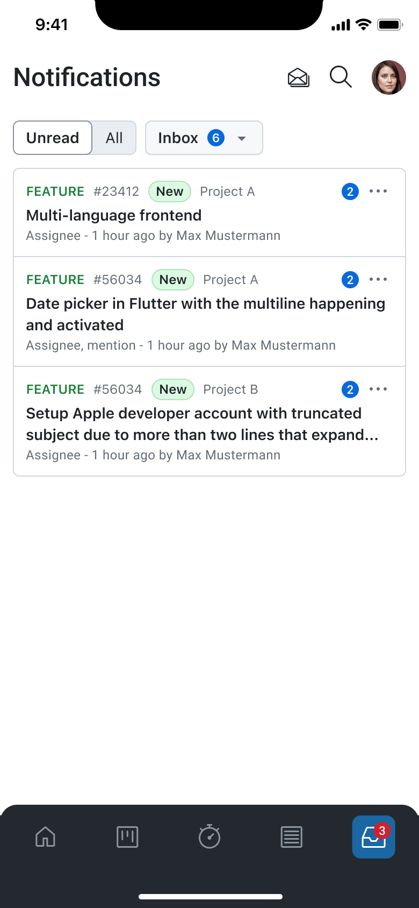
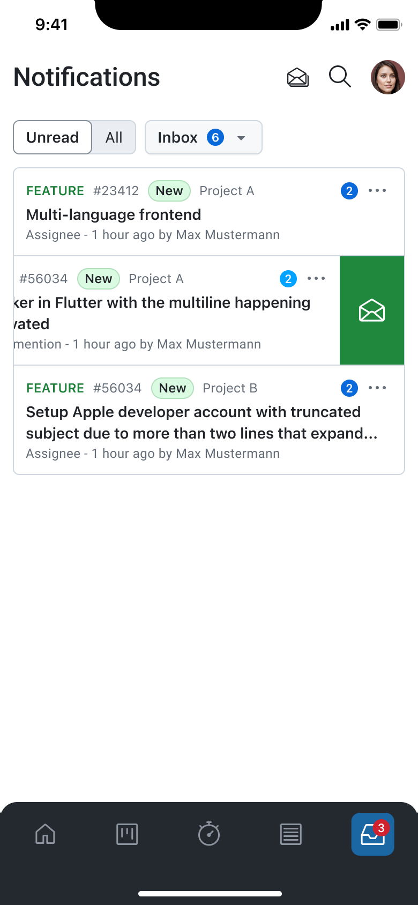
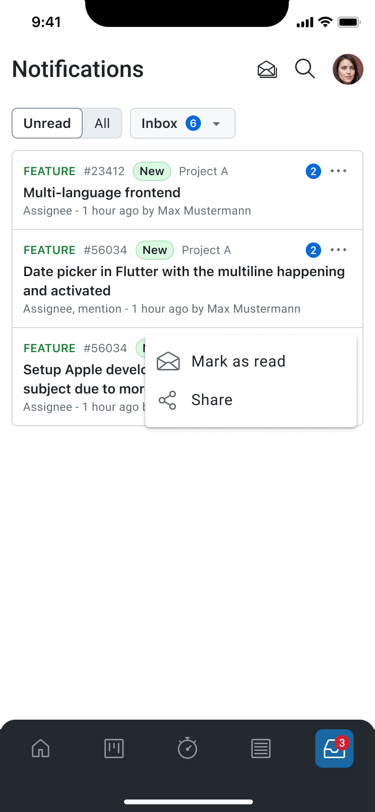
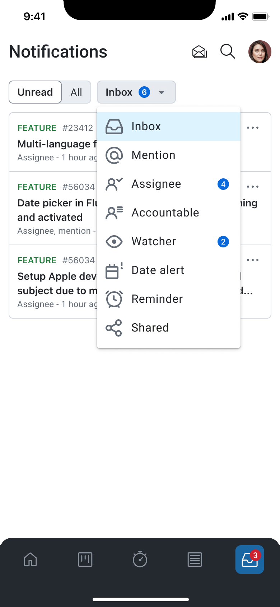

---
sidebar_navigation:
  title: Notification Center
  priority: 750
description: A centralized view of all updates, mentions, and activities that require the user’s attention in OpenProject mobile app.
keywords: Mobile app Notification Center, mobile notification, mobile notifications, notification, mobile mention
---

# Notification Center

The **Notification Center** provides a centralized view of all updates, mentions, and activities that require the user’s attention. It ensures users can stay informed about important changes across their projects, even while on the move. Notifications from the web or desktop application are synchronized with the mobile app, making it easy to keep track of all relevant activity in one place.

## Receiving and Viewing Notifications

After logging into the app, you will automatically receive notifications generated in their OpenProject environment. Whenever an update occurs—such as a comment, status change, or mention—the notification will appear inside the Notification Center. You can simply open the app and navigate to the Notification Center to view any new, unread items waiting for their attention.

You can also choose to display **all notifications**, not just unread ones. By toggling the switch to view all items, the Notification Center expands to include both read and unread notifications. This is useful for revisiting past activity or reviewing a complete history of updates.

## Viewing Notification Details

Tapping on a notification opens the associated work package directly in the mobile app. You are taken to the Activity tab of that work package, where the specific update that triggered the notification is highlighted. This makes it easy to understand the context of the notification and respond immediately if needed.

## Marking Notifications as Read

When a notification is opened or manually marked as read, it is removed from the **Unread** inbox. This allows you to maintain a clear and focused view of only pending items. For quicker inbox management, the Notification Center also provides an option to **mark all notifications as read** from the top bar, clearing the unread list in a single action.

## Switching Between Notification Queries

The Notification Center includes filters that allow you to switch between different notification queries, similar to the web interface. You can choose alternative inboxes—such as “Assignee,” “Mention,” or other notification categories their instance provides. When switching queries, the list updates immediately to show only the notifications relevant to that filter.

