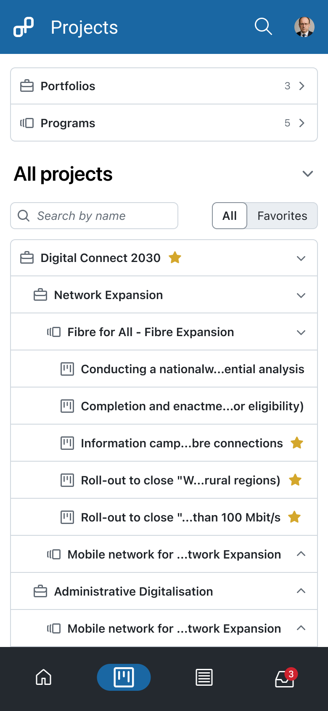
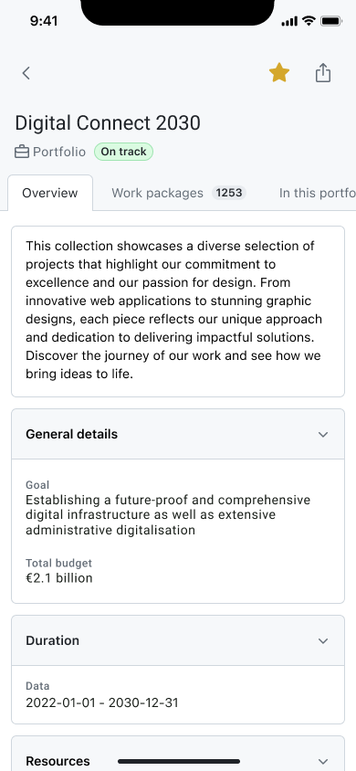
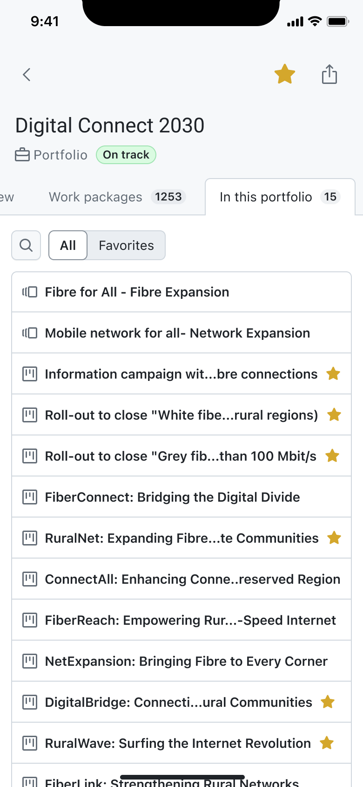

---
sidebar_navigation:
  title: Projects
  priority: 780
description: An organized view of all portfolios, programs, and projects you have access to.
keywords: Mobile app features projects, mobile project, mobile portfolio, mobile program, program, programme, project, portfolio, mobile app
---

# Projects

The **Projects module** in the OpenProject Mobile App gives you an organized view of all **portfolios, programs, and projects** you have access to. It allows you to **check status, attributes, and progress**, explore hierarchy, and navigate seamlessly between different levels of work.

## Purpose

The Projects module is designed to help you:
*   **Monitor progress and status** of projects, programs, and portfolios.
*   **View all attributes and key details** of a portfolio, program, or project.
*   **Understand hierarchy** by exploring the relationship between portfolios, programs, and projects.
*   **Access work packages and child projects** of portfolios, programs, and projects directly from the mobile interface.

This module is particularly useful for team members, project managers, and portfolio managers who need a **clear overview of ongoing work and its organization**.

## Project Index

The main screen of the Projects module acts as an **index page**, allowing you to:
*   **Enter Portfolios, Programs, or individual Projects** directly.
*   **Browse a hierarchical list of all projects**, expandable to show programs and child projects.
*   **Filter the list** to display only your **favorite projects** for quick access.

## Portfolio, Program, and Project Details

When you enter a portfolio, program, or project, the mobile app provides three key tabs for detailed insights:

1.  **Overview Tab**
    *   Shows the **description, status, and all available attributes** of the selected item.
    *   Provides a snapshot of key details at a glance.        
2.  **Work Packages Tab**
    *   Lists **all work packages** associated with the portfolio, program, or project.
    *   Allows you to view, open, and interact with tasks directly from the app.      
3.  **In this Portfolio / Program / Project**
    *   Displays all **projects or programs that belong to the selected portfolio, program, or project**.
    *   Helps you explore the hierarchy and drill down into individual initiatives.

