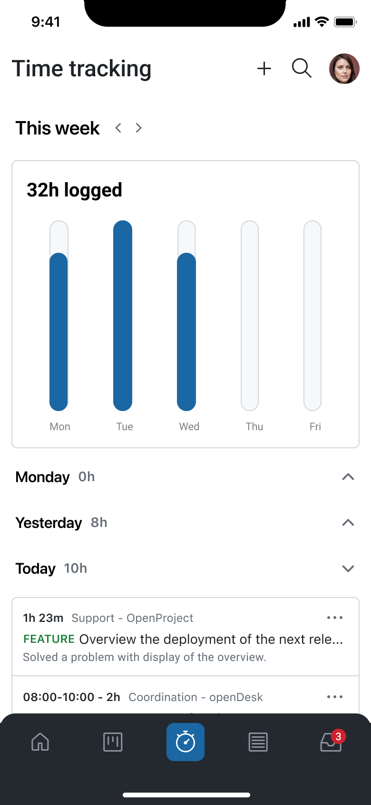
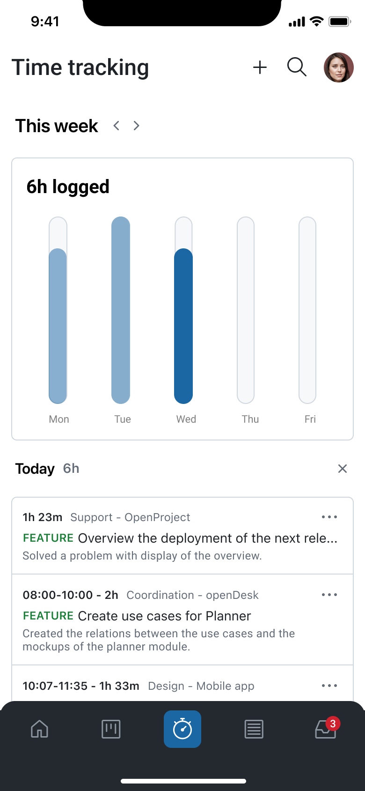
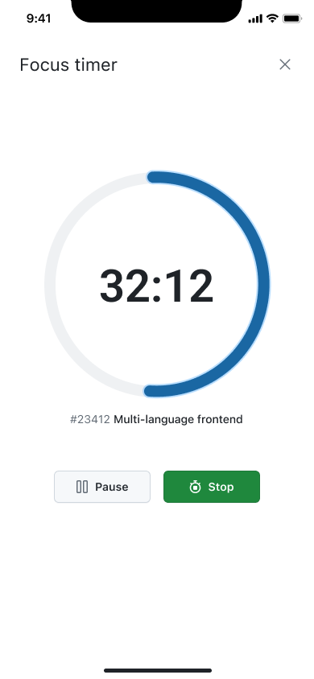
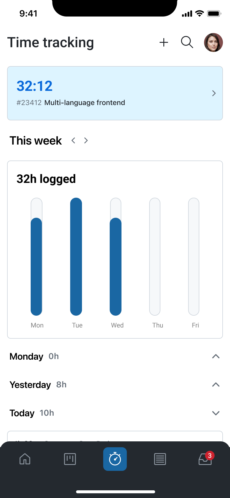
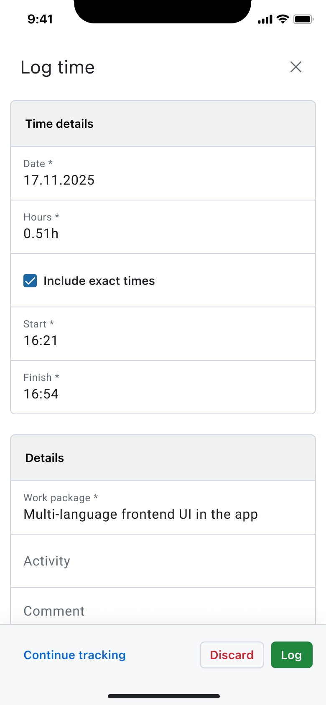

---
sidebar_navigation:
  title: Time tracking
  priority: 770
description: Enables you to easily record, review, and manage the time you spend on your work.
keywords: Mobile app features time tracking, time tracking, mobile time tracking, mobile time, log time, time logging, time-logging, time management, time, time entry, time log, timer focus, focus timer
---

# Time tracking

The **Time Tracking** module in the OpenProject Mobile App enables you to easily record, review, and manage the time you spend on your work. Whether you prefer logging time manually or using a real-time focus timer, the module offers a clear and efficient mobile workflow.

## Purpose

The Time Tracking feature helps you:
*   Keep accurate records of your work across projects
*   Maintain consistent time reporting while on the move
*   Review your weekly work patterns at a glance
*   Track focused work sessions without distractions

## Time Entries Index

The **Time Entries Index** provides a clear, chronological view of all your logged time. What you can do:
*   **Browse weekly overviews:** Move between the current week and previous weeks to see all your recorded time entries.
*   **Review logged hours:** See each entry with its associated work package, duration, and date.
*   **Quick view chart:** Easily see the total of hours recorded by day in the weekly chart.

This view is ideal for maintaining accurate records and verifying past entries.

## Timer Focus Mode

The **Timer Focus Mode** allows you to track time as it happens, helping you stay focused and avoid manual entry errors. What you can do:
*   **Start a focus timer** on any work package to measure your work session in real time.
*   **Let the timer run in the background**, even if you switch apps or lock your device.
*   **Stop the timer** when finished, and convert the session into a logged time entry.

## Log Time

The **Log Time** feature allows you to manually enter time spent on work packages. What you can do:
*   **Create a new time entry** for any work package.
*   **Specify the date, duration, and activity type**.
*   **Ensure accurate reporting** even if you didn’t use the focus timer.

