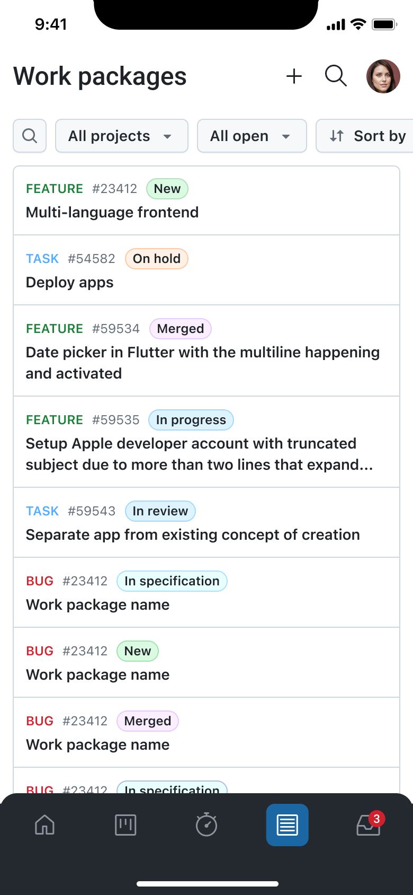
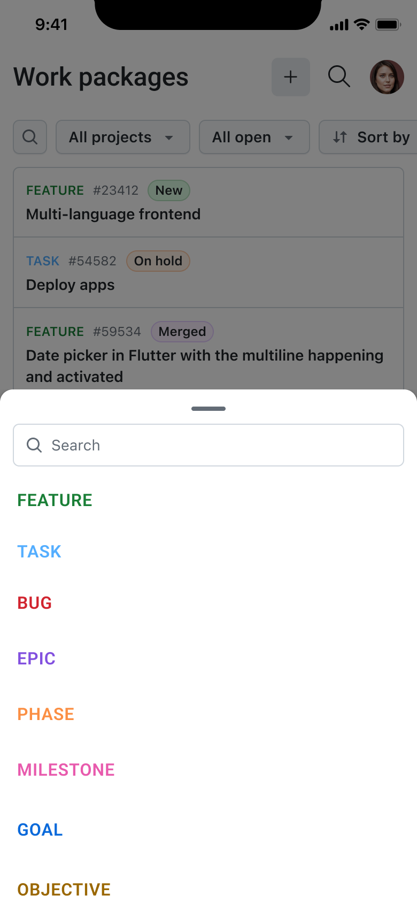
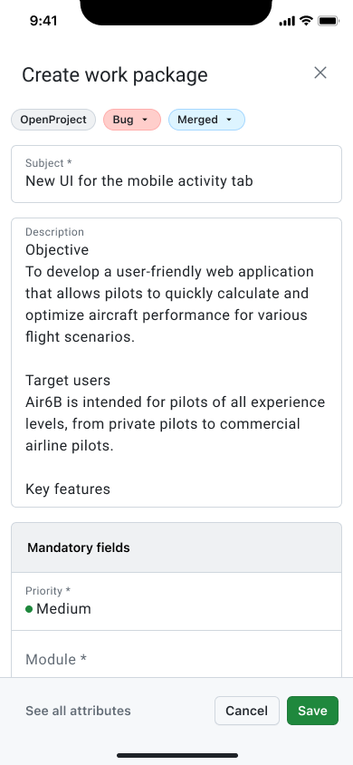
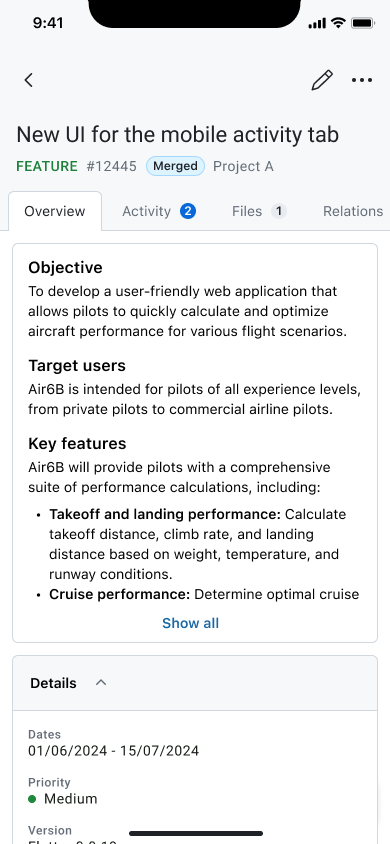
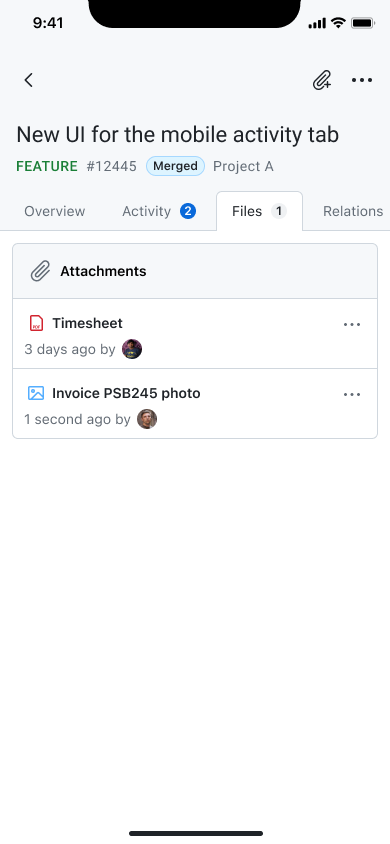
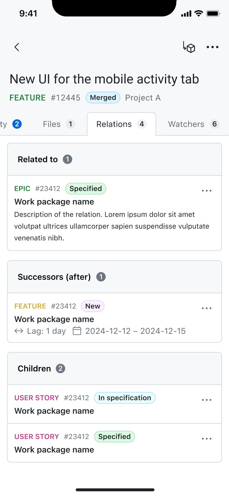
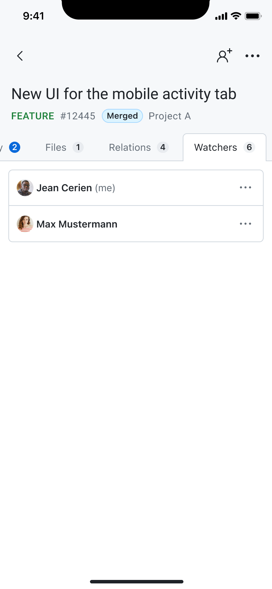
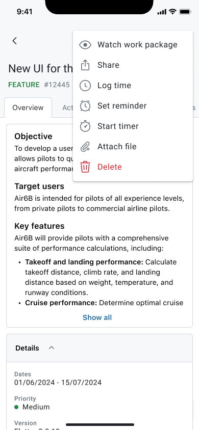
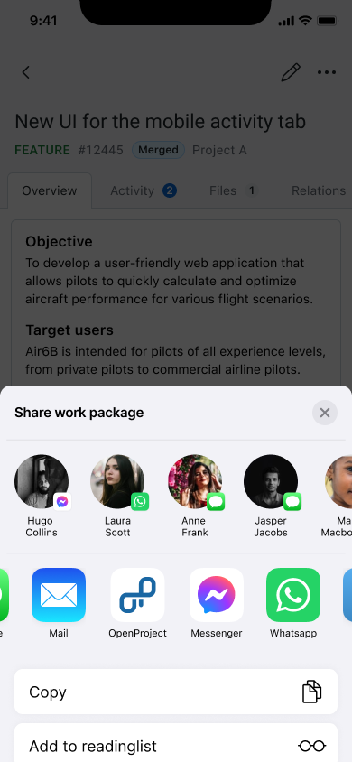

---
sidebar_navigation:
  title: Work packages
  priority: 760
description: Browse, search, create, update, and collaborate on work packages directly from your mobile device.
keywords: Mobile app features work packages, work package, work packages, create work package, edit work package, share work package, mobile app
---

# Work packages

The **Work Packages** module is one of the central components of the OpenProject Mobile App. It allows you to browse, search, create, update, and collaborate on work packages directly from your mobile device. The module includes full support for commenting, file attachments, relations, watchers, time logging, timers, and reminders.

## Purpose

The Work Packages module enables you to:
*   Access and manage tasks across all your projects
*   Create new work packages quickly or with full detail
*   Update existing work packages
*   Collaborate through comments and mentions
*   Attach files, images, and photos directly from your device
*   Manage relations, watchers, and attributes
*   Track time and set reminders for upcoming work

## Work Packages Index

When accessing the Work Packages module, you are presented with a list of open work packages from all projects. This serves as the starting point for navigation and work package management, making it easy to view ongoing work at a glance. The module also offers flexible filtering tools that allow users to refine the list by selecting a specific project, applying a saved query, and adjusting sorting and grouping options. As filters are modified, the list dynamically adapts to show the corresponding work packages.

In addition to filtering, you can quickly locate specific work packages through the search functionality. Tapping the search icon opens a search bar where users can type keywords and instantly view matching results.

## Create Work Packages

Creating new work packages is also fully supported. You can tap the &quot;+&quot; button to begin the creation process. After selecting the work package type and project, you can fill in the required fields to quickly create a new entry. For more detailed entries, you may choose to open the full attribute list and complete optional fields before saving, resulting in a comprehensive work package with all available metadata.

## Overview and Edit

You can open any work package to view its details and make updates. Editing is initiated through the pencil icon, giving access to fields such as the title, description, status, and any available custom fields. All updates are applied directly in the work package, so users can easily refine information as work progresses.

## Collaboration and Communication

The module supports collaboration through the **Activity** tab, where you can participate in discussions. Comments can be added or replied to, mentions can be used to involve other users, and images may be included directly in the comment body. This makes it easier to share updates, coordinate with your team, or provide visual information on the go.

Attachments are handled through the **Files** tab. You can upload files, photos, or videos from their device, or take a new picture using the camera and attach it immediately. This allows work packages to hold all relevant documentation in one place.

Relations between work packages can be managed in the **Relations** tab, where you can connect tasks to one another by adding new relations when needed. Similarly, watchers can be added from the **Watchers** tab to keep stakeholders informed about progress or changes.

## Time Tracking and Reminders

Time can be logged directly from a work package by opening the **More** menu and selecting the logging option. You can enter duration, date, activity, and any other necessary details to record their work accurately. For continuous time tracking, the app also supports starting a live timer from the same **More** menu. This opens the timer in focus mode, allowing you to track their work in real time while minimizing distractions.

Additionally, you can set reminders from within the **More** menu. By configuring a reminder for a specific date and time, the app will notify you when it’s time to return to that work package or take action on it.

## Sharing Work Packages

Work packages can be easily shared using the device’s **native sharing features**. From within a work package, you can access the system share from the **More** menu to send a direct link to the item through messaging apps, email, collaboration tools, or any other app supported by their operating system. This simplifies cross-platform communication and makes it effortless to bring others into the loop.

