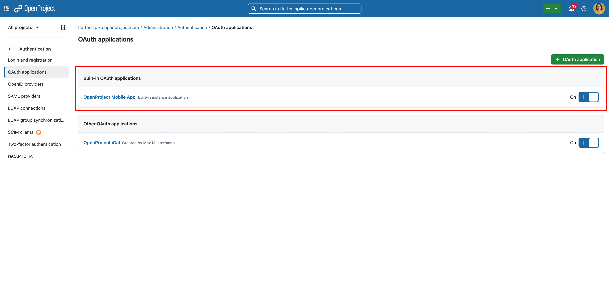
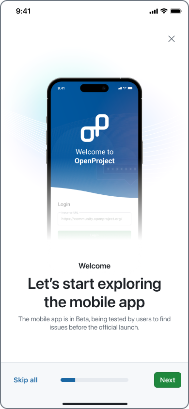
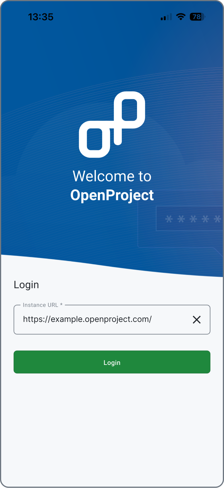
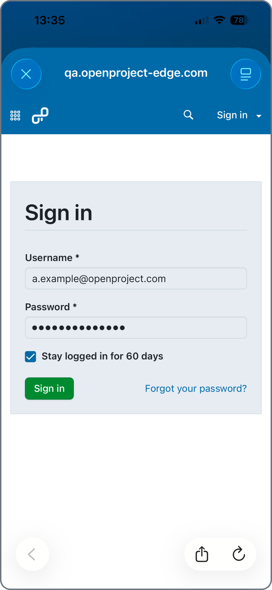
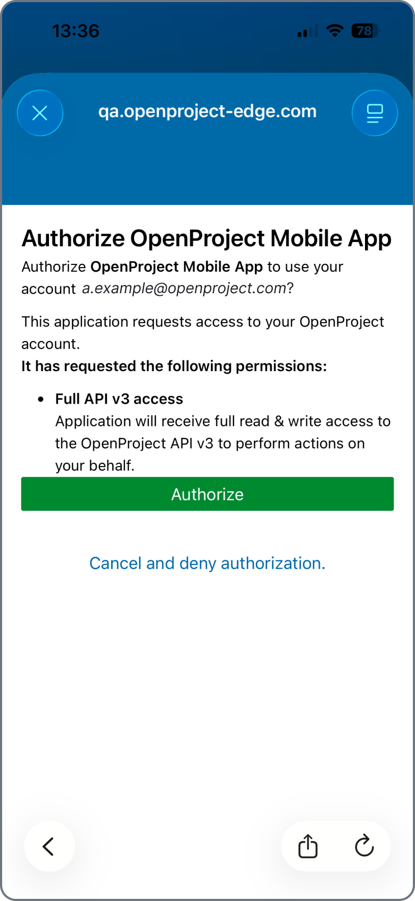

---
sidebar_navigation:
  title: "First Steps: Access, Download, and Log In"
  priority: 800
description: Follow these steps to install and start using the OpenProject Mobile App (Beta).
keywords: mobile app first steps, getting started, log in, log-in, login, mobile log in, openproject mobile app, download, access, install, mobile installation
---

# First Steps: Access, Download, and Log In

Follow these steps to install and start using the **OpenProject Mobile App (Beta)**:

## Check the Requirements

Before downloading the app, please ensure your environment meets the following prerequisites:

*   **An active OpenProject account:** Either from an **OpenProject Cloud** workspace or an **OpenProject On-premises** installation with API access enabled.
*   A **signed certificate** (**https** not http) on your instance to be able to log in.
*   **Minimum OpenProject version:** 17.0.0
> [!NOTE]
> If you have a previous version of OpenProject you can connect your OpenProject instance by asking your administrator to enable the Built in OAuth applications flag under `_{BASE_URL}/admin/settings/experimental_`.        
*   **Minimum system requirements:**
    *   **iOS 15** or later
    *   **Android 12** or later
*   **Built-in OAuth applications enabled:** Make sure that the built-in OAuth applications are **enabled in your administration settings** (`{BASE_URL}/admin/oauth/applications`). This is required for successful login from the mobile app.

*   **Network connection:** Internet access is required for syncing data with your OpenProject instance.
> [!NOTE]
> Some features, such as deep-linking and real-time push notifications, may depend on your organization’s configuration or will become available in future updates.

## Download the App

The **OpenProject Mobile App** is available for both major platforms:

*   **iOS:** [App Store link](?).
*   **Android:** [Google Play link](?).

Search for **“OpenProject”** in your app store, or use the direct links above to download the app.

## Open the App

After installation, open the app on your device. You’ll be greeted with a **short onboarding** on the app features and then prompted to **log in** to your OpenProject instance.

## Choose Your Instance

Enter the complete **base URL** of your instance (for example, `https://yourcompany.openproject.com`).  

## Log In with Your Credentials

*   Once your instance is confirmed, log in using your **OpenProject username and password** in the browser modal that opened.

    
*   The app will ask you for a permission to have full access to the **OpenProject API v3** to authorize your account and securely connect to your workspace.

## Start Exploring

You’re all set! Once logged in, you can:
*   View and edit **work packages**
*   **Comment** and reply to discussions
*   **Create** and track work packages easy and fast
*   **Log time** and run focus **timers**
*   Stay updated with **local notifications**