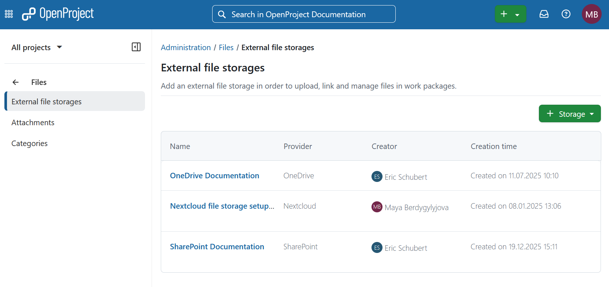

---
sidebar_navigation:
  title: File storages
  priority: 990
description: File storages in OpenProject.
keywords: file storages, Nextcloud setup, Nextcloud integration, OneDrive setup, OneDrive, Sharepoint
---

# External file storages

You can connect your OpenProject installation to Nextcloud, OneDrive or SharePoint. To do that navigate to **Administration** -> **Files** -> **External file storages** and select the respective option.

Please keep in mind that you need to have administrator rights to be able to set up the integration.

## Nextcloud integration setup guide

For detailed guide on the initial setup, please consult the [Nextcloud integration setup guide](../../integrations/nextcloud/).

For instructions on using the integration after the setup has been complete please refer to the [Nextcloud integration user guide](../../../user-guide/file-management/nextcloud-integration/).

[feature: one_drive_sharepoint_file_storage]

> [!NOTE]
> This feature includes using both OneDrive and SharePoint integrations.

## OneDrive integration (Enterprise add-on) setup guide

For detailed guide on the initial setup, please consult the [OneDrive integration setup guide](../../integrations/one-drive/).

For instructions on using the integration after the setup has been complete please refer to the [OneDrive integration user guide](../../../user-guide/file-management/one-drive-integration/).

## SharePoint integration (Enterprise add-on) setup guide

For detailed guide on the initial setup, please consult the [SharePoint integration setup guide](../../integrations/share-point/).

For instructions on using the integration after the setup has been complete please refer to [SharePoint integration user guide](../../../user-guide/file-management/sharepoint-integration/).

## Health status

For troubleshooting guidance related to file storages, visit the [File storage troubleshooting](./health-status) page. Here you will find possible explanations and
suggested solutions and will be able to conduct health status checks with immediate results. If you encounter any challenges not addressed here, do not hesitate to reach out to the [OpenProject community](https://community.openproject.org/projects/openproject/forums) or [support team](https://www.openproject.org/contact/) for further assistance.
