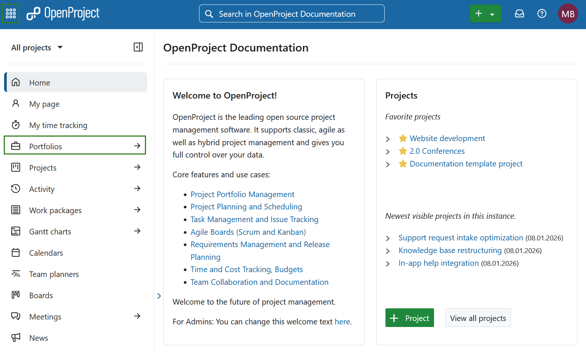
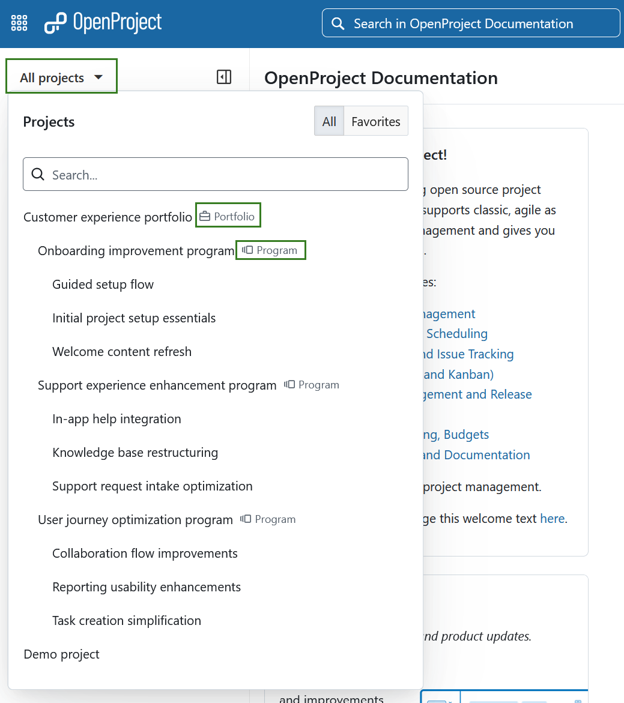
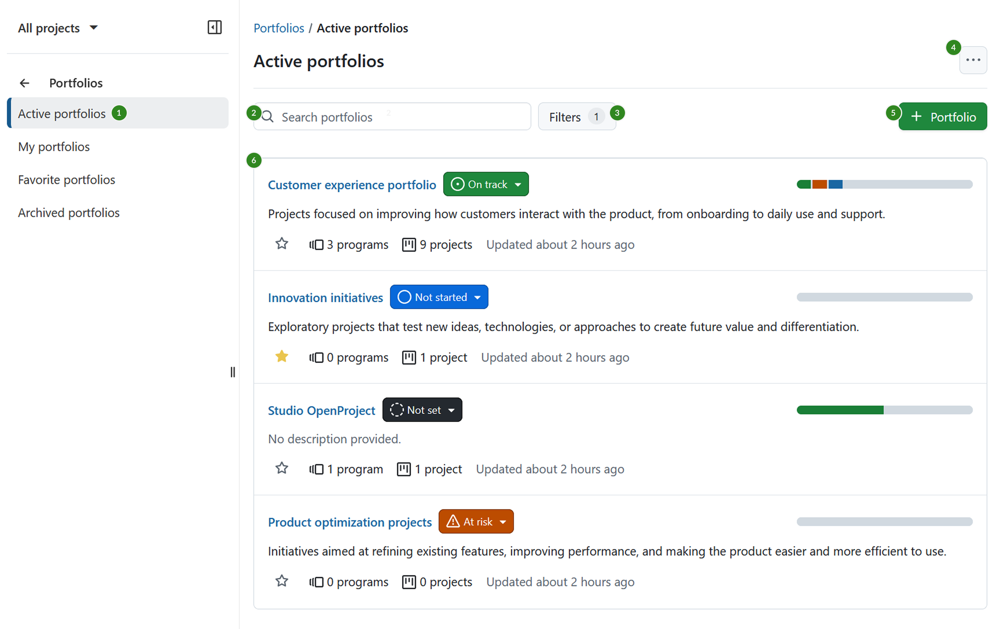
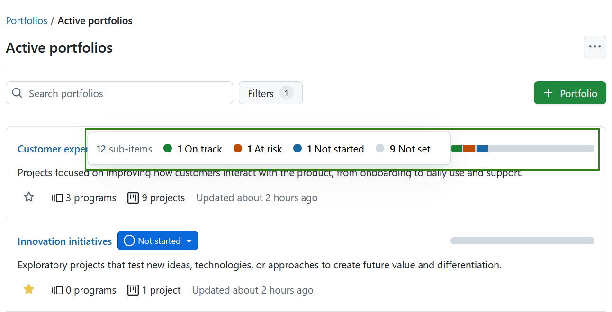
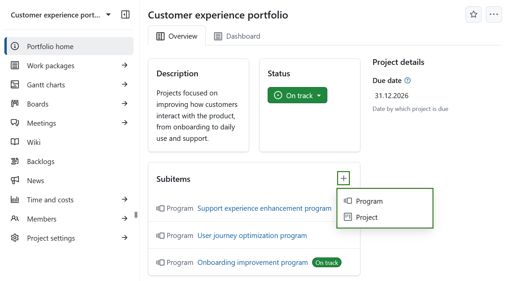

---
sidebar_navigation:
  title: Portfolios
  priority: 950
description: Create and manage project portfolios in OpenProject.
keywords: portfolio, project, program, programme, portfolios, project portfolio, portfolio management 
---

# Portfolios (Enterprise add-on)

[feature: portfolio_management ]

Portfolios in OpenProject allow you to organize and manage work at a strategic level by grouping related programs and projects into a single workspace. Information can be gathered about the portfolio in its entirety, allowing to align it to the organization's goals without having to be involved at an operational level.

A portfolio is designed for visibility and coordination rather than execution. It helps stakeholders understand progress, status, and structure across larger initiatives without managing individual tasks or work packages directly.

Portfolios in OpenProject enable you to:

- Group related programs and projects under a common strategic context
- Track overall progress using aggregated indicators
- Navigate large sets of initiatives more effectively
- Provide a clear, structured overview for decision-making and reporting

In OpenProject, projects, programs, and portfolios are all workspaces. While they share common properties — such as members, permissions, status, and description — they serve different purposes:

- Projects are used for executing work
- Programs group related projects
- Portfolios provide a high-level overview across multiple programs and projects.

| Topic | Content |
|------|---------|
| [Portfolios structure in OpenProject](#portfolios-structure-in-openproject) | Understand how portfolios, programs, and projects are structured. |
| [Hierarchy and composition rules](#hierarchy-and-composition-rules) | Learn which workspace types can be combined and how hierarchies are enforced. |
| [Example portfolio structures](#example-portfolio-structures) | See common portfolio hierarchy examples. |
| [Navigate to portfolios](#navigate-to-portfolios) | Learn how to access portfolios in OpenProject. |
| [Portfolios overview explained](#portfolios-overview-explained) | Understand the portfolios overview page and its elements. |
| [Portfolios filters](#portfolio-filters) | Filter portfolios by status, membership, or favorites. |
| [Portfolio home page](#portfolio-home-page) | Learn what you can do on a portfolio home page. |

## Portfolios structure in OpenProject
A **portfolio** is a type of workspace that groups related **programs** and **projects** to provide a strategic overview.

A portfolio can contain:
- **Programs** — workspaces that group related projects based on shared strategic goals or business objectives. Programs may exist independently or contain projects.
- **Projects** — workspaces where teams plan, track, and execute day-to-day work.

### Hierarchy and composition rules

To prevent invalid or unclear workspace structures, there are certain rules for portfolio structuring in OpenProject. 

- When creating or editing a workspace, following parent assigning rules are true:
	- Portfolios cannot have a parent and always exist at the top level.
	- Programs can have a portfolio as a parent, but they can also be created without one. This supports bottom-up portfolio management, where programs exist first and a portfolio may be defined later.
	- Projects can have a portfolio, program, or another project as a parent.
- Programs and projects can exist at the same hierarchical level within a portfolio. 
- Programs can, but are not required to contain projects.
- A portfolio may include:
  - only programs,
  - only projects, or
  - a combination of both.

### Example portfolio structures

The following examples illustrate common (non-exhaustive) portfolio structures in OpenProject.

#### Example 1: Portfolio with multiple programs and projects

**Portfolio A**
- **Program A.1**
  - Project A.1.1
  - Project A.1.2
  - …
- **Program A.2**
- **Program A.3**

#### Example 2: Mixed hierarchy with programs and standalone projects

**Portfolio X**
- **Program Y**
  - Project Y.1
- **Program Z**
  - Project Z.1
- Project O
- Project I

#### Example 3: Portfolio containing only programs

**Portfolio D**
- **Program D1**
- **Program D2**
- **Program D3**

#### Example 4: Portfolio containing only projects

**Portfolio 123**
- Project 1
- Project 2
- Project 3

A portfolio can technically remain empty and function as a standalone workspace. However, in such cases, using a project instead of a portfolio is usually sufficient.

## Navigate to portfolios

To view the portfolio overview, select **Portfolios** from the global modules menu on the left, or from the menu behind the grid icon in the header navigation.

To open a specific portfolio, use the **All projects** dropdown menu in the top left corner and select the portfolio in the same way as you would select a project. Portfolios and programs are visually distinguished by dedicated icons next to their names in the list.

Portfolios can also be accessed from the [Project lists overview](../projects/project-lists).

## Portfolios overview explained

The **Portfolios overview** page lists all portfolios you have access to and serves as the main entry point for portfolio management.

The page includes the following elements (refer to the annotated screenshot for details):

1. **Predefined portfolio filters** on the left (see [Portfolio filters](#portfolio-filters)).
2. A **search bar** in the center to quickly find portfolios by name. 
3. A **Filters** button next to the search bar, providing additional filtering options based on attributes such as status, project attributes, or project life cycle phases.
4. A **More options** (three dots) menu in the top-right corner, containing the option to enable **Zen mode**.
5. The **+ Portfolio** button to create a new portfolio.
6. A **list of portfolios**, where each portfolio is displayed in a separate box.

Each portfolio is displayed in a box containing the following information:

- **Portfolio name**
- **Portfolio status**, which can be edited directly
- **Portfolio description**
- **Status bar** showing the aggregated status of subitems (programs and projects):
  - Subitems are grouped by status and visualized in the status bar. 
  - Hovering over the status bar displays a detailed status breakdown.  
  - The status bar is shown empty if the portfolio has no subitems or if none of the subitems have a status set.
  
    
  
- **Favorite indicator** (star icon), allowing you to mark or unmark a portfolio as a favorite
- **Number of programs and projects** in the portfolio:
  - This number includes all programs and projects in the hierarchy where the portfolio is the root.
  - For example, in *Portfolio A → Program B → Project C → Project D → Project E*, the count is **1 program** and **3 projects**.
  
- **Last updated** timestamp

### Portfolio filters

By default, the portfolio overview displays all active portfolios you can access. Use the following filters in the left side menu to refine your view:

- **Active portfolios** — returns all currently active portfolios available to you.
- **My portfolios** — returns portfolios where you are a member.
- **Favorite portfolios** — returns portfolios you marked as favorites.
- **Archived portfolios** — returns portfolios that are no longer active but you still have permission to view.

## Portfolio home page

A portfolio can be edited, copied, set to public, used as a template, and deleted in the same way as a project. For more information, see the [Projects guide](../projects).

One difference is that the **Subitems** widget on a portfolio home page allows you to add both **programs** and **projects** as subitems.

